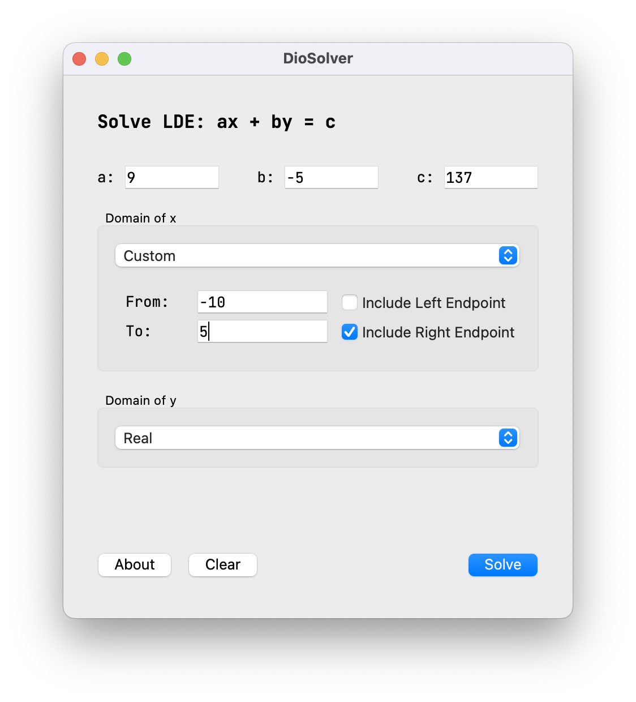
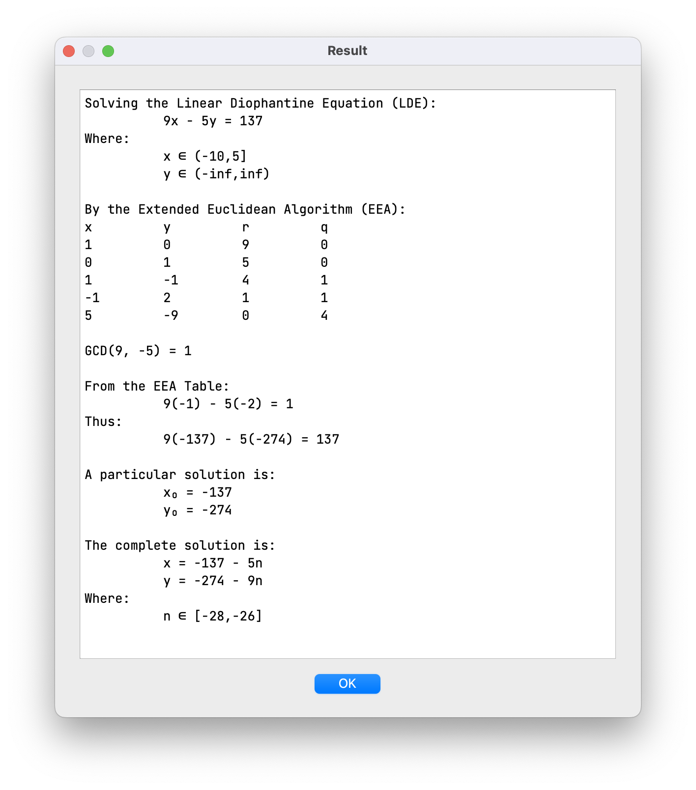
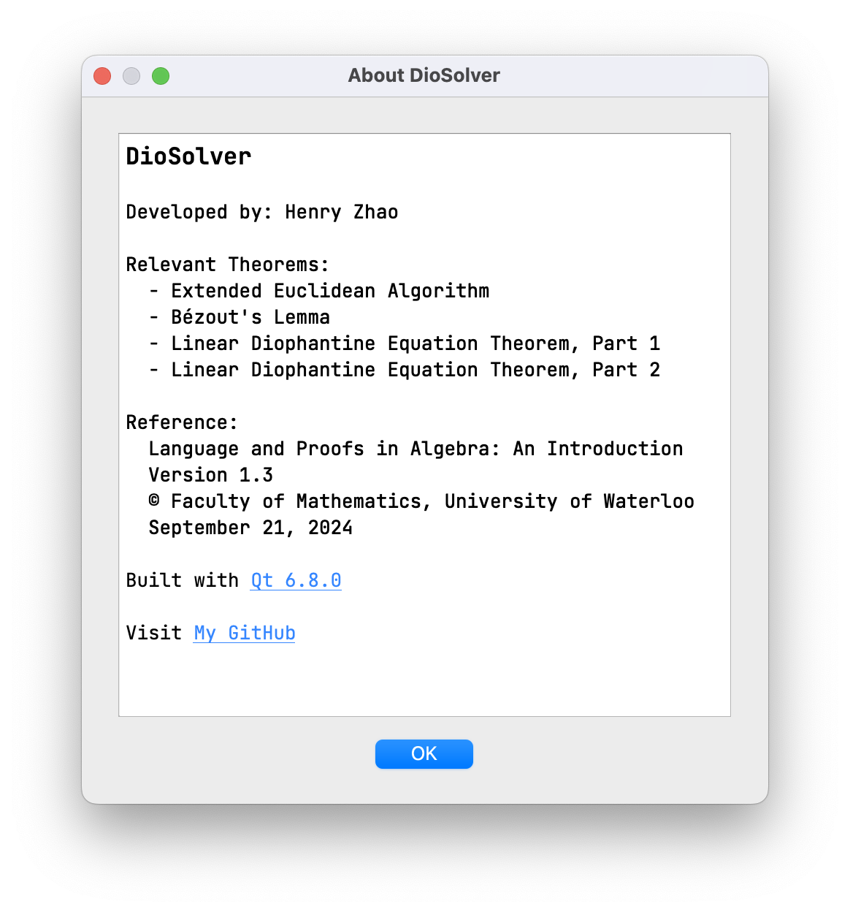

# DioSolver

*A visual guide to solving linear Diophantine equations.*

While taking MATH 135 (Algebra) at the University of Waterloo, I became 
fascinated by equations of the form `ax + by = c`. They look simple, but 
solving them often means moving through several connected ideas: divisibility, 
the Extended Euclidean Algorithm, Bézout's identity, and the structure of the 
complete solution set.

I wanted to make those steps easier to follow. DioSolver takes the values of
`a`, `b`, and `c`, along with domains for `x` and `y`, and turns the solution
into something you can explore rather than just look up.

It walks through the process of:

1. Calculating the greatest common divisor with the Extended Euclidean
   Algorithm.
2. Finding a particular solution.
3. Deriving the full solution set.
4. Applying the domain restrictions to the final answers.

## See it in action

The Qt interface is designed to make the mathematics approachable: enter an
equation, choose the domains, and inspect the resulting work. The screenshots
below are stored in `docs/screenshots/` so they remain available with the
repository.







## A little about the project

The mathematical logic lives in a reusable C core. It can be used through the
interactive `diosolver-cli` program or the Qt 6 Widgets interface,
`diosolver-gui`.

The original Racket implementation is still kept in `racket/` as a source-only
reference. It is useful for comparing the same ideas across two languages,
but it is not part of the CMake build.

## Build the project

The CLI, GUI, and tests are enabled by default. Because the GUI is enabled,
the default configure requires Qt 6. The core also uses `c-storage-kit` as a
Git submodule. If the repository was cloned without submodules, initialize it
before configuring:

```sh
git submodule update --init --recursive
```

From the repository root:

```sh
cmake -S . -B build
cmake --build build
ctest --test-dir build --output-on-failure
```

The core tests are split by module, so an individual area can be run with
CTest's name filter. For example:

```sh
ctest --test-dir build -R diosolver.interval --output-on-failure
```

Run the CLI with:

```sh
./build/diosolver-cli
```

To build just the GUI target after configuring the project:

```sh
cmake --build build --target gui
```

To build the core and CLI without installing or configuring Qt:

```sh
cmake -S . -B build \
  -DDIOSOLVER_BUILD_GUI=OFF \
  -DDIOSOLVER_BUILD_TESTS=OFF
cmake --build build
```

## Build the GUI with Qt

With Qt 6 available to CMake, configure the project with your Qt installation
prefix:

```sh
cmake -S . -B build \
  -DDIOSOLVER_BUILD_GUI=ON \
  -DCMAKE_PREFIX_PATH=/path/to/Qt/6.x.x/platform
cmake --build build --target gui
```

The resulting executable is `build/diosolver-gui` (or the platform-equivalent
executable name).

## Build the GUI in CLion

Open the repository root in CLion and add these options to the active CMake
profile's generation options:

```text
-DDIOSOLVER_BUILD_GUI=ON
-DCMAKE_PREFIX_PATH=/path/to/Qt/6.x.x/macos
```

The Qt path is required when CLion cannot find the Qt 6 package on its own.
After adding it, choose **Tools → CMake → Reset Cache and Reload Project**.
Once CMake finishes successfully, `diosolver_gui` will be available as a build
and run target.
